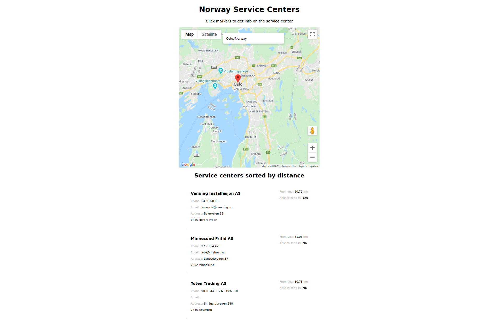

Tool to find closest service centers in Norway. Built with React using the Google Maps API.

  

 
Solving how to populate the map with all the pointers and then calculating and building a new list based on distance from where your input coordinates was a challenge.
