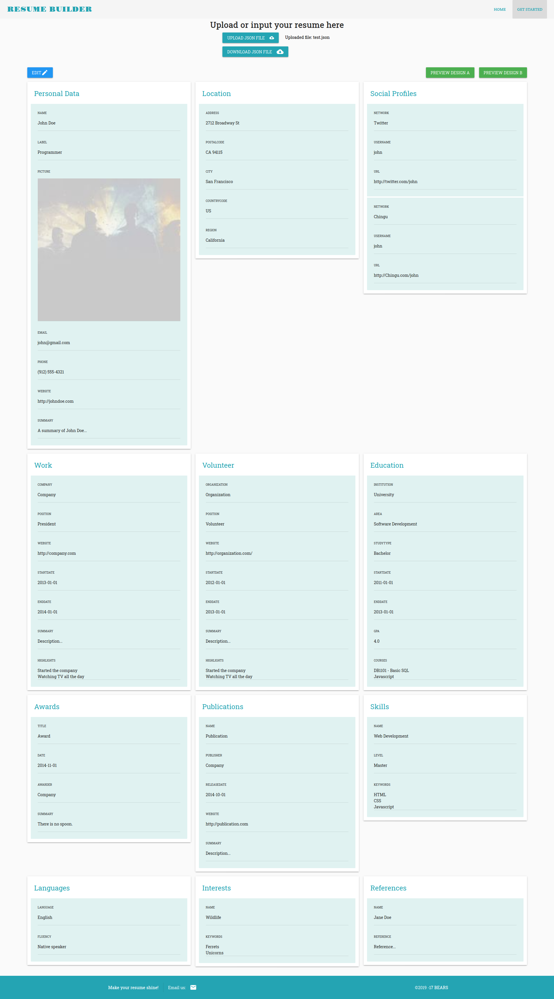
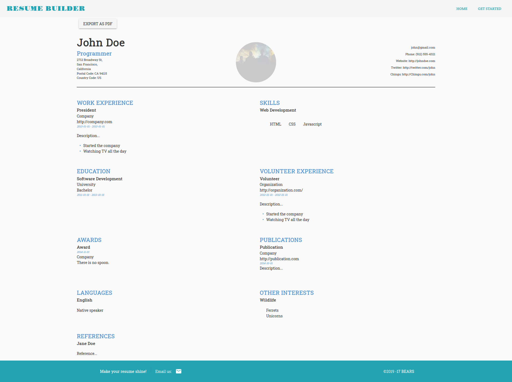

A tool to easily edit and build upon for a resume using Vue and Vuetify. Inspired by and works with jsonresume.org. Trying out Vue for the first time was fun.

  

 
The greatest challenge was to style and export to PDF which we solved through using native CSS printing styles rather than using JavaScript to do it.
 

  

 

